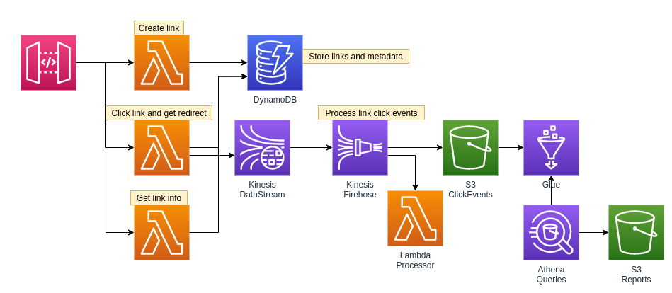

# LinkShrink
### A completely serverless Link Shrinking system with click analytics.



### [Click here for API Documentation using Swagger](https://broswen.github.io/linkshrink/)

### Usage

1. Send POST request to `test.com/shrink` with details to create a link. `clicks` defines if click events should be saved for analytics. `expires` defines when the link will return 404s and no longer redirect.

```json
{
    "link": "https://youtube.com",
    "clicks": true,
    "expires": "2021-07-22T20:55:00",
    // "slug": "custom slug is optional"
}
```

The response will list the slug (unique id) of the link.
```json
{
    "slug": "1vVGu3wpWWRiUZhXWJT7tElmzNw"
}
```
The full link will look like `https://test.com/1vVGu3wpWWRiUZhXWJT7tElmzNw`. This is what end users should click for redirection/analytics.

2. Send a GET request to `test.com/link/1vVGu3wpWWRiUZhXWJT7tElmzNw` to get metadata about the link. `key` is the api key id used to create the link.
```json
{
    "slug": "1vVGu3wpWWRiUZhXWJT7tElmzNw",
    "link": "https://youtube.com",
    "key": "fp0y0hnmph",
    "clicks": true,
    "expires": "2021-07-22T20:55:00.000Z",
    "created": "2021-07-18T20:27:41.793Z"
}
```

### TODO List
- [x] use typed errors
- [x] create glue crawler
- [x] create glue table/database
- [ ] use athena to create monthly reports
- [x] allow custom slug
